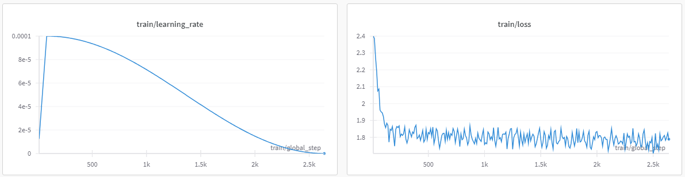

# qLoRA fine tuning study

## 개요

💡 Huggingface 모델을 qLoRA를 이용해서 fine tuning

#### PEFT(Parameter-Efficient Fine-Tuning)
###
    
    - 엄청난 비용이 드는 Large pretrained model의 모든 파라미터들을 파인튜닝 하지 않고 효과적으로 큰 모델을 개조할 수 있는 라이브러리이다. PEFT 메서드는 모델의 파라미터들 중에 작은 일부만을 파인튜닝하여 의미있는 비용 절감 효과를 가질 수 있다.

###

#### LoRA(Low-Rank Adaptation)
###

    - PEFT 메서드로 large matrix를 low-rank matrices로 분해한다. 이렇게 과감하게 줄인 파라미터들은 파인튜닝에 사용된다.

###

#### QLoRA(Quantization + Low-Rank Adaptation)
###

    - LoRA + 양자화

###

 

## 설명 📝

#### BitsAndBytesConfig

    bnb_config = BitsAndBytesConfig(
        load_in_4bit=True,
        bnb_4bit_use_double_quant=True,
        bnb_4bit_quant_type="nf4",
        bnb_4bit_compute_dtype=torch.bfloat16
    )

    tokenizer = AutoTokenizer.from_pretrained(model_id)
    model = AutoModelForCausalLM.from_pretrained(model_id, quantization_config=bnb_config, device_map={"":0})

- `load_in_4bit`: 4비트 양자화로 기본 모델을 로드
- `bnb_4bit_use_double_quant`: 양자화 상수도 양자화하는 이중 양자화 설정
- `bnb_4bit_quant_type`: nf4(fp4 or nf4)
- `bnb_4bit_compute_dtype`: 계산 데이터 유형, torch.float32보다 torch.bf16이 빠르다(낮은 정밀도).

#### LoraConfig

    config = LoraConfig(
        r=8,
        lora_alpha=32,
        #target_modules=["query_key_value"],
        target_modules=[
        "q_proj",
        "o_proj",
        "k_proj",
        "v_proj"],
        lora_dropout=0.05,
        bias="none",
        task_type="CAUSAL_LM"
    )   

- `peft.prepare_model_for_kbit_training`: 모델을 학습시키기 전에 준비시키는 메서드, fp32 형식으로 레이어를 정규화하고  임베딩된 레이어를 만든다. (peft.prepare_model_for_int8_training is deprecated)
- `fp32`: 일반적으로 모델 학습에 사용되는 부동 소수점 형식
- `r`: 하위 행렬의 차원, LoRA 어댑터에 512*64 및 64*512 매개변수가 있음을 의미
- `lora_alpha`: 가중치 행렬의 배율 인자
- `lora_dropout`: LoRA 레이어의 dropout확률로 과적합을 방지하는데 사용된다.
- `bias`: 편향을 훈련할 경우 all, 아닐경우 none, LoRA 편향만 훈련하려는 경우 lora_only
- `task_type`: 사용중인 모델에 맞게 설정

#### TrainingArguments

    trainingArgs = transformers.TrainingArguments(
        output_dir=finetunes_model_name,
        bf16=True,
        num_train_epochs=3,
        per_device_train_batch_size=4,
        gradient_accumulation_steps=2,
        gradient_checkpointing=True,
        optim="paged_adamw_8bit",
        logging_steps=5,
        save_strategy="epoch",
        learning_rate=2e-4,
        weight_decay=0.001,
        max_grad_norm=0.3,
        warmup_ratio=0.03,
        group_by_length=False,
        lr_scheduler_type="cosine",
        disable_tqdm=True
    )

- `output_dir`: 모델 예측 및 체크포인트가 저장될 디렉토리
- `num_train_epochs`: 전체 데이터 사용(epoch) 횟수
- `per_device_train_batch_size`: GPU 당 배치 사이즈
- `gradient_accumulation_steps`: Gradient Accumulation은 모든 미니 배치의 가중치를 업데이트하는 대신 누적된 기울기에 따라 모델을 업데이트한다. 이떄 업데이트 하기 전 누적되는 기울기의 개수
- `gradient_checkpointing`: 심층 신경망을 훈련하는 동안 메모리 사용량이 제한된 상황에서 메모리 사용량을 줄이는 데 사용되는 기술, backward pass 중에 intermediate activations을 한번에 모두 저장하지 않고 선택적으로 activations을 다시 계산하여 메모리 사용량을 줄인다.
- `optim`: 사용할 옵티마이저
- `logging_steps`: 콘솔 로그 출력 step 단위
- `save_strategy`: no | epoch | steps
- `weight_decay`: 가중치 감소는 손실 함수에 페널티 항목을 추가하여 과적합을 방지하기 위해 모델을 훈련하는 동안 사용되는 정규화 기술, 가중치 감소는 모델 가중치 중 큰값에 페널티를 주는 손실 함수에 항목을 추가하여 작동한다.(낮은 값(1e-8)부터 시작하여 단계적으로 늘려야한다.)
- `max_grad_norm`: Gradient norm은 기울기 벡터의 크기또는 길이로 함수의 변화율을 나타낸다. 훈련 중 업데이트 단계 크기를 제어하는데 도움이된다.
- `warmup_ratio`: warm-up 비율 설정, warm-up은 특정 수의 step 혹은 epoch에 걸쳐 초기값에서 전체 값까지 학습 속도를 점진적으로 증가시키는 학습 전략을 나타낸다.
- `lr_scheduler_type`: Learning rate scheduler는 학습중에 learning_rate를 동적으로 조정하여 모델 성능을 향상 시키는데 사용된다.

#### Trainer
###

    trainer = transformers.Trainer(
        model=model,
        train_dataset=data["train"],
        args=trainingArgs,
        data_collator=transformers.DataCollatorForLanguageModeling(tokenizer, mlm=False),
    )

###

## 테스트 🖥️

#### polyglot-ko-12.8b + koAlpaca QLoRA 파인 튜닝

#### koAlpaca 데이터셋 예시
###

    - Question: 다양한 자전거 종류와 그 특징은 무엇인가요?
    - Answer: 자전거는 MTB, 로드바이크, 하이브리드, 픽시 등 많은 종류로 나눌 수 있습니다. 
    MTB: 속도보다는 용도에 맞게 디스크 브레이크와 탄탄한 프레임, 부품이 사용되어 울창한 산길을 주로 달려도 높은 제동력으로 안전하게 멈추거나 낮은 기어로 업힐이 용이합니다. - 로드바이크: 속도를 위해 공기저항을 최소화하는 드롭바가 장착된 자전거입니다. 높은 속도에서는 감속 브레이크를 사용해야 하므로, 안정적인 타이어와 경량의 프레임이 사용되며 강한 제동력도 필요합니다. - 하이브리드: 간단한 오프로드와 호수쪽 라이딩 등 가볍게 즐길 수 있는 다목적적 자전거로, MTB와 로드바이크의 장점을 결합하여 만들어진 자전거입니다. - 픽시: 보통의 브레이크 대신 후륜 브레이크로 탑재되어 있으며, 달리다가 페달을 멈출 수 없기 때문에 위급 상황에 대처하기 힘듭니다. 최근에는 트랙바이크에서 태생을 뚫어나와 인기를 얻고 있습니다. 이러한 다양한 자전거는 용도에 따라 구매할 수 있으며, 개인 취향에 따라 선택할 수 있습니다.

###

#### Base Model(polyglot-ko-12.8b)
###

    - Question: 다양한 자전거 종류와 그 특징은 무엇인가요?
    - Answer: 참고로 위 링크에서 질문 하신거 답변 드립니다**
    질문자: Where is the best bike shop?저: Gobi에 있는 The Stratosphere Peurigtinger Rider Shop 가세요질문자: What are road bikes and why?

###

#### Fine Tuning Model(polyglot-ko-12.8b + koAlpaca)
###

    - Question: 다양한 자전거 종류와 그 특징은 무엇인가요?
    - Answer: 보통 사람들이 자주 쓰이는 자전거의 종류는 다음과 같습니다.
    자전거 종류 - MTB 산악자전거, 로드바이크 등

    MTB 산악자전거: Mountain Bike의 약자로, 비포장 도로를 비롯하여 여러 험한 지형을 빠르게 달릴 수 있도록 설계한 자전거입니다. 이 자전거는 보통 프레임이 무겁고, 타이어의 폭이 좁으며, 크기가 작은 것이 특징입니다.

    로드바이크: Road Bike의 약자로, 포장 도로에서 타기 좋게 만든 자전거입니다. 이 자전거는 바퀴가 얇고 작고 프레임은 가벼우며, 브레이크와 변속기, 기어 등 장비가 갖춰져 있습니다.

    하이브리드 자전거: 일반적인 자전거와 로드바이크의 중간 정도의 성능을 가지고 있으며, 보통 바퀴의 폭이 적당하고 변속기, 기어 등이 있습니다.

    미니벨로: 작고 귀여운 형태의 바퀴가 2인치 ~ 20인치의 작은 사이즈의 자전거입니다. 이 자전거는 속도나 주행이 목적이 아니라 도시 등에서 교통수단으로 쓰입니다.

    여성용 자전거: 바구니와 바구니, 체인 커버, 의자 등을 장착하여 여성들이 사용하기 좋게 만들어진 자전거

###

## 출처
- [qlora](https://abvijaykumar.medium.com/fine-tuning-llm-parameter-efficient-fine-tuning-peft-lora-qlora-part-2-d8e23877ac6f)
- [lora](https://huggingface.co/docs/peft/main/en/package_reference/lora)
- [quantization](https://huggingface.co/docs/transformers/main_classes/quantization)
- [peft](https://huggingface.co/docs/peft/main/en/package_reference/peft_model)